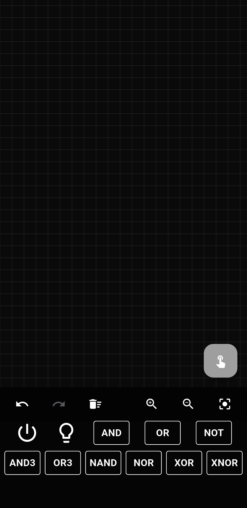
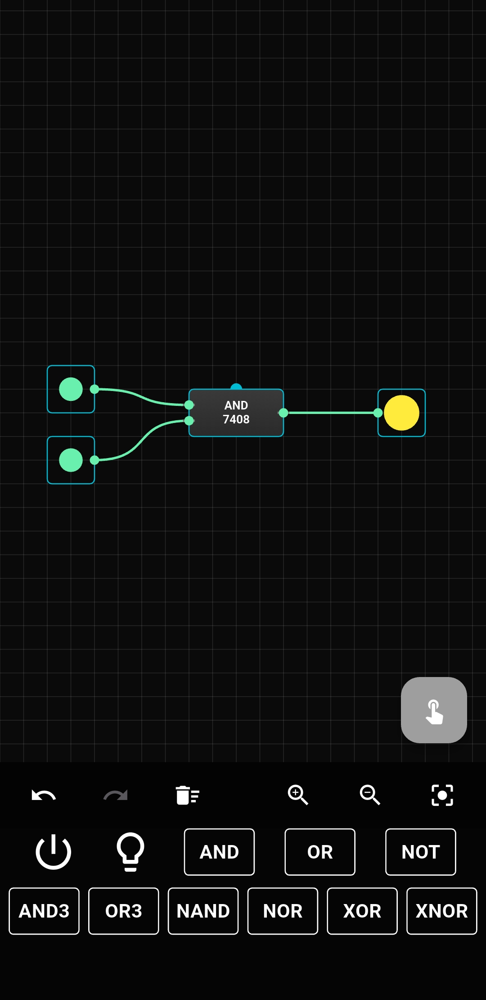

# WireFlow

WireFlow is an interactive and intelligent logic-circuit builder designed for students, electronics hobbyists, and anyone learning digital logic.  
It provides a realistic visual interface where you can place components, connect wires with precision, simulate logic in real time, and visualize mistakes instantly.

---

## 🚀 Features

### 🎛️ Drag & Drop Circuit Builder
Place logic gates, ICs, switches, LEDs, and input/output devices anywhere on the workspace with smooth, intuitive gestures.

### 🔵 Smart Wire Connection System
- Tap a pin to highlight it in **blue**
- Tap another pin to connect
- Wires automatically snap for perfect alignment  

This makes wiring simple, fast, and frustration-free.

### 💡 Realistic Component Design
All components look and behave like real ICs:
- Accurate pin layout  
- Clear labels  
- Realistic design aesthetics  

### ⚡ Live Logic Simulation
Outputs update instantly as you toggle inputs or move components.  
No compile, no refresh — real-time logic.

### 🔥 Error Detection (Burn Effect)
If you make an invalid or dangerous connection:
- The IC glows with a soft “burning” highlight  
- Helps you learn and debug circuits quickly

### 💾 Save & Load Circuits
Store circuit designs and continue your work at any time.

---

## 📱 Why WireFlow?

WireFlow is built to be:
- **Beginner-friendly** for students
- **Powerful** for advanced digital experimenters
- **Smooth & modern**
- **Highly visual** for easier learning

Whether you're studying digital electronics or experimenting for fun, WireFlow gives you a clear, realistic way to understand how circuits behave.

---

## 🛠️ Tech Stack

- **Flutter**
- **Riverpod**
- Custom **Canvas Rendering**
- **Real-time logic engine**

---

## 📦 Installation

Clone the repository:

```sh
git clone https://github.com/ReverseEngineeringDude/WireFlow.git
cd WireFlow
```
Install dependencies:
```sh
flutter pub get
```

Run the app:
```sh
flutter run
```

---

📸 Screenshots





---

🤝 Contributing

Contributions are welcome!
If you’d like to improve components, add new ICs, optimize the logic engine, or enhance UI/UX — feel free to open an issue or PR.


---

📜 License

This project is licensed under the MIT License.


---

⭐ Support

If WireFlow helped you learn or build circuits faster, consider giving the repo a ⭐ on GitHub!


---